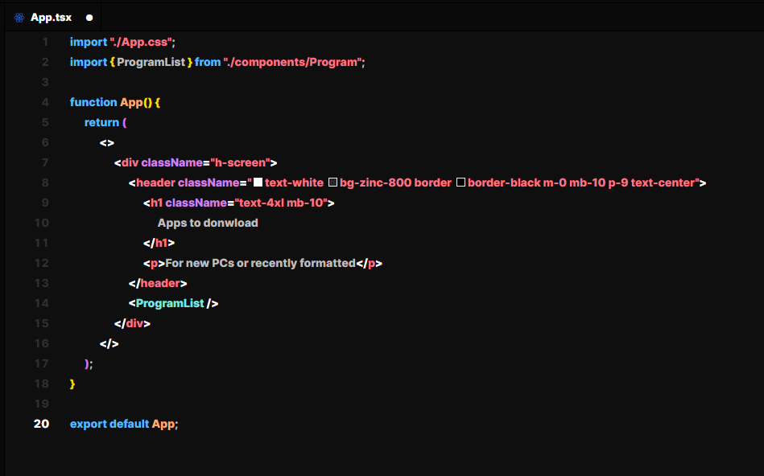

# Hitko Theme

A minimal theme for VS Code.

## Installation

1. Install theme from the [Marketplace]()
2. Go to `File > Preferences > Color Theme`
3. Select `Hitko Theme`

## Issues

Please [file an issue](https://github.com/Nilsojunior/hitko-theme/issues) on GitHub if you encounter any problems.
